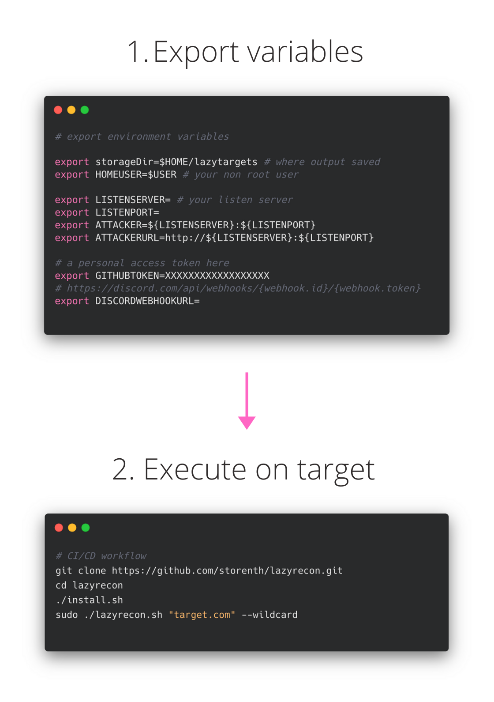

```
  _
 | | __ _ ____ _   _ _ __ ___  ___  ___  _ __
 | |/ _  |_  /| | | |  __/ _ \/ __|/ _ \|  _ \
 | | (_|  / / | | | | | |  __/ (__  (_) | | | 
 |_|\__ _|___/ \__  |_|  \___|\___|\___/|_| |_v2
               |___/
```

<p align="center">
<a href="https://twitter.com/storenth"></a>
<a href="https://discord.gg/fR2QVrWBTq"></a>
</p>

Lazyrecon is a subdomain discovery tool that discovers and resolves valid subdomains then performs SSRF/LFI/SQLi fuzzing and port scanning. It has a simple modular architecture and is optimized for speed while working with github and wayback machine.

# Features
- Super fast asynchronous execution
- CI/CD ready
- HTML/pdf reports
- Discord integration
- Background listen server
- Domain name, list of domains, IP, CIDR input notations support
- Teardown and program exit housekeeping
## Workflow
<h3 align="center">
  </a>
</h3>

# About

This script is intended to automate your reconnaissance process in an organized fashion by performing the following:

- Create a dated folder with recon notes for target
- Grab subdomains using `subfinder`, `assetfinder`, `gau`, `waybackurls`, `github-subdomains`
- Subdomain discovery through alterations and permutations using `altdns` and `dnsgen`
- Filtering out live subdomains from a list of hosts using `shuffledns`
- Check 1-200,8000-10000 for http(s) probes using `httpx`
- Get visual part using `aquatone`
- Perform `masscan` on live servers
- Automatically brute-forces services with default credentials using `hydra`
- Scanning for known paths and CVEs using `nuclei`
- Shot for [SSRF](https://www.hackerone.com/blog-How-To-Server-Side-Request-Forgery-SSRF)/[LFI](https://www.allysonomalley.com/2021/02/11/burpparamflagger-identifying-possible-ssrf-lfi-insertion-points/)/SQLi based on wayback machine's data
- Check for potential request smuggling vulnerabilities using `smuggler`
- Perform `ffuf` using custom WordList based on the [top10000.txt](https://github.com/danielmiessler/RobotsDisallowed/blob/master/top10000.txt)
- Generate reports and send it to Discord

The point is to get a list of live IPs, attack available network protocols, check for common CVEs, perform very simple directory bruteforce then use provided reports for manual research.

# Installing
- `Linux` tested
- `Mac` users must have `nmap` installed first
### CI/CD way
You can use stateful/stateless build agent (worker). There is no additional time is required for provisioning.
It may look tricky cause masscan/nmap/naabu root user required.
1. Fill in these required environment variables inside: `./lazyconfig`:
```bash
export HOMEUSER= # your normal, non root user: e.g.: kali
export HOMEDIR= # user's home dir e.g.: /home/kali
export STORAGEDIR= # where output saved, e.g.: ${HOMEDIR}/lazytargets
# Check for your router configuration to handle incoming TCP connection on the port you specify
# Local listen server starts automatically as 0.0.0.0:$LISTENPORT using --server parameter
export LISTENSERVER= # public IP of your router that handle incoming TCP connection
export LISTENPORT= # listen port of your local server
export SERVICEPORT= # check router's port forwarding or equal to $LISTENPORT
export ATTACKER=${LISTENSERVER}:${LISTENPORT}
export ATTACKERURL=http://${LISTENSERVER}:${LISTENPORT}
export GITHUBTOKEN=XXXXXXXXXXXXXXXXXX # a personal access token here
export DISCORDWEBHOOKURL= # https://discord.com/api/webhooks/{webhook.id}/{webhook.token}
export GOPATH=$HOMEDIR/go
export PATH=$GOPATH/bin:$GOROOT/bin:$HOME/.local/bin:$PATH
export GO111MODULE=on
```
2. Enable new environment `source ./lazyconfig`
3. Call `sudo -E ./install.sh`
4. Execute `sudo ./lazyrecon.sh "hackerone.com"`

### Github Actions way
Customize `.github/workflows/test-install-action.yaml` using `--discord` to receive report:
```yaml
- name: Execute on target
  run: |
    export HOMEDIR=$HOME
    export STORAGEDIR=$GITHUB_WORKSPACE/lazytarget
    sudo -E ./install.sh
    sudo ./lazyrecon.sh "bugcrowd.com" --quiet --discord
```
[WIP] Limitations: no port forwarding on github so you need to host listen server for now.
### Hard way
Config your environment variables and dependencies using [INSTALL.MD](https://github.com/storenth/lazyrecon/blob/ci-cd-feature/INSTALL.md)


If you faced with some issues, feel free to join [Discord](https://discord.gg/fR2QVrWBTq), open PR or file the bug.

# Usage
Execute with `sudo` because of `masscan`:
```bash
▶ sudo ./lazyrecon.sh tesla.com --wildcard
```

| **Parameter**  | **Description**                                       | **Example**                                     |
| ---------------|-------------------------------------------------------|-------------------------------------------------|
| --wildcard     | Subdomains reconnaissance '*.tesla.com' (default)     | ./lazyrecon.sh tesla.com --wildcard             |
| --single       | One target instance 'tesla.com'                       | ./lazyrecon.sh tesla.com --single               |
| --ip           | Single IP of the target machine                       | ./lazyrecon.sh 192.168.0.1 --single --ip        |
| --list         | List of subdomains to process for (time sensitive)    | ./lazyrecon.sh "./testa.txt" --list             |
| --cidr         | Perform network recon, CIDR notation                  | ./lazyrecon.sh "192.168.0.0/16" --cidr          |
| --server       | Deploy local server to handle incoming connection     | ./lazyrecon.sh tesla.com --server               |
| --mad          | Wayback machine's stuff                               | ./lazyrecon.sh tesla.com --mad                  |
| --fuzz         | SSRF/LFI fuzzing                                      | ./lazyrecon.sh tesla.com --mad --fuzz           |
| --alt          | Additionally permutate subdomains (*.tesla.com only)  | ./lazyrecon.sh tesla.com --wildcard --alt       |
| --brute        | Basic directory bruteforce (time sensitive)           | ./lazyrecon.sh tesla.com --single --brute       |
| --discord      | Send notifications to discord                         | ./lazyrecon.sh tesla.com --discord              |
| --quiet        | Enable quiet mode                                     | ./lazyrecon.sh tesla.com --quiet                |


# Methodology
0. Use [dnsperftest](https://github.com/cleanbrowsing/dnsperftest) to know your best resolvers
1. Run `./lazyrecon.sh`
2. Check output reports of aquatone, nuclei, nmap, hydra, server_log, ffuf
3. Explore file upload vulnerabilities
4. Perform Google, Trello, Atlassian, Github, Bitbucket dorking
5. Check JS sources for credentials, API endpoints
6. Investigate `XHR` requests, fuzz parameters and variables
7. Check exploit-db.com for target-specific CVE
8. GET/POST Bruteforce for directories: fuzbo0oM-top10000 --> raft --> target specific
9. Continue bruteforcing using custom Headers (X-Custom-IP-Authorization: 127.0.0.1; X-Original-URL:)
10. Try bypass 401/403 errors using [notable](https://github.com/filedescriptor/Unicode-Mapping-on-Domain-names) methods (`%23`, `/%2e/`, `admin.php%2500.md` etc)
11. Look for XSS [xsscrapy.py](https://github.com/DanMcInerney/xsscrapy) or [XSSTRON](https://github.com/RenwaX23/XSSTRON)

# Origin
This project was inspired by original v1.0 [Ben Sadeghipour](https://github.com/nahamsec/lazyrecon) and aimed to implement some of the best practices like [Mechanizing the Methodology](https://www.youtube.com/watch?v=L_qoz2_Qyhk), [TBHM](https://docs.google.com/presentation/d/1MWWXXRvvesWL8V-GiwGssvg4iDM58_RMeI_SZ65VXwQ), [Subdomain Takeovers](https://www.hackerone.com/blog/Guide-Subdomain-Takeovers), [Request Smuggling](https://portswigger.net/web-security/request-smuggling), [SSRF](https://www.hackerone.com/blog-How-To-Server-Side-Request-Forgery-SSRF), [LFI](https://www.allysonomalley.com/2021/02/11/burpparamflagger-identifying-possible-ssrf-lfi-insertion-points/) and [Bruteforce](https://danielmiessler.com/blog/the-most-interesting-disallowed-directories/) based on [Custom wordlist](https://www.youtube.com/watch?v=W4_QCSIujQ4&t=1237s&ab_channel=Nahamsec).
# Notable articles
1. IDOR: https://www.aon.com/cyber-solutions/aon_cyber_labs/finding-more-idors-tips-and-tricks/?utm_source=newsletter&utm_medium=email&utm_campaign=bug_bytes_110_scope_based_recon_finding_more_idors_how_to_hack_sharepoint&utm_term=2021-02-17
2. SSRF: https://notifybugme.medium.com/finding-ssrf-by-full-automation-7d2680091d68 and https://rez0.blog/hacking/2019/11/29/rce-via-imagetragick.html

### Notes
 - `aquatone` replaced by [headless chromium async script](https://github.com/storenth/lazyrecon/compare/0a9c4c586ee4...24c35f9cadd0) based on performance
 - `Sublist3r` replaced with `subfinder` based on Twitter [discussion](https://twitter.com/Jhaddix/status/1293118260808843264)
 - `nmap` replaced with `masscan` based on its features and Twitter [duscussion](https://twitter.com/DanielMiessler/status/1286721113343447040)
 - `smuggler` forked from its [original](https://github.com/gwen001/pentest-tools/blob/master/smuggler.py) aimed to get lightweight solution included this [PR](https://github.com/gwen001/pentest-tools/pull/10)
 - ~~`grep` `meg`'s output for [Location](https://twitter.com/hunter0x7/status/1293168500672954368) in order to exclude 301/302 status codes~~
 (replaced with `httpx -fc 301,302` approach)
 - ~~`httpx -ip` used without `dnsprobe` based on @pdiscoveryio Twitter [answer](https://twitter.com/pdiscoveryio/status/1338163970557894656)~~
 - `altdns` used based on [Scrutiny on the bug bounty](https://docs.google.com/presentation/d/1PCnjzCeklOeGMoWiE2IUzlRGOBxNp8K5hLQuvBNzrFY/)
 - `massdns` fully replaced with `shuffledns` because of [issue](https://github.com/blechschmidt/massdns/issues/73)
 - WIP: you can track activity in Projects To Do board


**Acknowledgement:** This code was created for personal use with hosts you able to hack/explore by any of the known bug bounty program. Use it at your own risk.